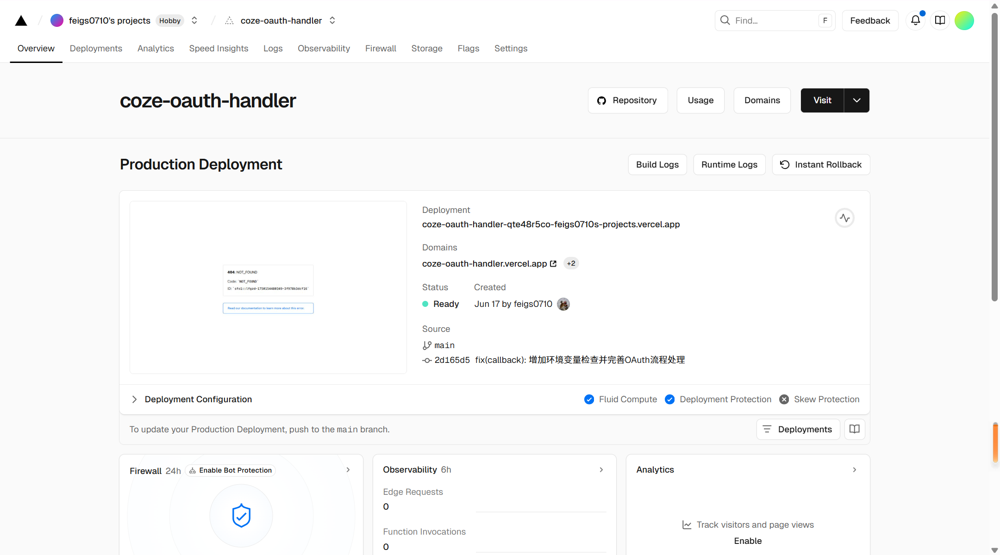

# 重定向URI配置完整指南

## 📋 什么是重定向URI

重定向URI（Redirect URI）是OAuth 2.0认证流程中的关键组件，用户授权后，Coze.com会将用户重定向到这个地址，并携带授权码。

## 🏠 本地开发环境

### 推荐配置（免费）
```
http://localhost:8080/oauth/callback
```

**优点**：
- ✅ 完全免费
- ✅ 无需域名
- ✅ 适合开发测试
- ✅ 我们的测试工具已配置

**使用场景**：
- 开发阶段测试
- OAuth配置验证
- 本地调试

## 🌐 免费云平台选择

### 1. Vercel（推荐）

**配置示例**：
```
https://your-app-name.vercel.app/oauth/callback
```

**获取步骤**：
1. 访问 [vercel.com](https://vercel.com)
2. 使用GitHub账户登录（免费）
3. 创建新项目
4. 部署后获得免费域名

**优点**：
- ✅ 完全免费
- ✅ 自动HTTPS
- ✅ 全球CDN
- ✅ 易于部署

### 2. Netlify

**配置示例**：
```
https://your-app-name.netlify.app/oauth/callback
```

**获取步骤**：
1. 访问 [netlify.com](https://netlify.com)
2. 注册免费账户
3. 部署静态站点
4. 获得免费子域名

**优点**：
- ✅ 免费套餐慷慨
- ✅ 自动HTTPS
- ✅ 简单部署

### 3. Railway

**配置示例**：
```
https://your-app-name.up.railway.app/oauth/callback
```

**获取步骤**：
1. 访问 [railway.app](https://railway.app)
2. 使用GitHub登录
3. 部署应用
4. 获得免费域名

**优点**：
- ✅ 支持后端服务
- ✅ 免费额度
- ✅ 自动HTTPS

### 4. Render

**配置示例**：
```
https://your-app-name.onrender.com/oauth/callback
```

**获取步骤**：
1. 访问 [render.com](https://render.com)
2. 注册免费账户
3. 连接GitHub仓库
4. 部署获得域名

**优点**：
- ✅ 免费静态站点
- ✅ 自动HTTPS
- ✅ 持续部署

## 🔧 快速部署方案

### 方案1：简单静态页面（推荐新手）

创建一个简单的HTML页面处理OAuth回调：

```html
<!DOCTYPE html>
<html>
<head>
    <title>OAuth Callback</title>
    <meta charset="utf-8">
</head>
<body>
    <h1>OAuth授权处理中...</h1>
    <script>
        // 获取URL参数
        const urlParams = new URLSearchParams(window.location.search);
        const code = urlParams.get('code');
        const state = urlParams.get('state');
        const error = urlParams.get('error');
        
        if (code) {
            document.body.innerHTML = `
                <h1>✅ 授权成功！</h1>
                <p>授权码: ${code}</p>
                <p>请复制此授权码到您的应用中</p>
            `;
        } else if (error) {
            document.body.innerHTML = `
                <h1>❌ 授权失败</h1>
                <p>错误: ${error}</p>
            `;
        }
    </script>
</body>
</html>
```

### 方案2：Node.js服务器

```javascript
const express = require('express');
const app = express();

app.get('/oauth/callback', (req, res) => {
    const { code, state, error } = req.query;
    
    if (code) {
        res.send(`
            <h1>✅ 授权成功！</h1>
            <p>授权码: ${code}</p>
            <script>window.close();</script>
        `);
    } else {
        res.send(`
            <h1>❌ 授权失败</h1>
            <p>错误: ${error}</p>
        `);
    }
});

app.listen(process.env.PORT || 3000);
```

## 📱 移动端和桌面应用

### 自定义URL Scheme
```
yourapp://oauth/callback
```

### 深度链接
```
https://yourapp.com/oauth/callback
```

## 🔒 安全配置要求

### 生产环境必须满足：
1. **使用HTTPS**：
   ```
   ✅ https://example.com/oauth/callback
   ❌ http://example.com/oauth/callback
   ```

2. **域名验证**：
   - 确保域名归您所有
   - 配置正确的DNS记录

3. **路径一致性**：
   - 代码中的重定向URI必须与OAuth应用配置完全一致

## 🛠️ 配置步骤详解

### 步骤1：选择平台
根据需求选择合适的平台：
- **开发测试**：使用 `localhost:8080`
- **演示部署**：使用 Vercel 或 Netlify
- **生产环境**：使用自有域名

### 步骤2：部署回调页面
1. 创建简单的HTML页面或服务器
2. 部署到选择的平台
3. 获得完整的回调URL

### 步骤3：配置OAuth应用
1. 在Coze.com开发者控制台
2. 编辑OAuth应用设置
3. 添加重定向URI
4. 保存配置

### 步骤4：测试配置
```bash
# 使用我们的测试工具
python oauth_test_tool.py
```

## 💡 最佳实践建议

### 开发阶段
```
重定向URI: http://localhost:8080/oauth/callback
优点: 免费、快速、适合调试
```

### 演示阶段
```
重定向URI: https://your-demo.vercel.app/oauth/callback
优点: 免费HTTPS、易于分享、专业外观
```

### 生产阶段
```
重定向URI: https://yourdomain.com/oauth/callback
优点: 品牌一致、完全控制、高可用性
```

## 🚨 常见错误及解决

### 错误1：重定向URI不匹配
```
错误信息: redirect_uri_mismatch
解决方案: 确保OAuth应用配置与代码中的URI完全一致
```

### 错误2：HTTP协议被拒绝
```
错误信息: invalid_redirect_uri
解决方案: 生产环境必须使用HTTPS
```

### 错误3：域名无法访问
```
错误信息: 网络错误
解决方案: 检查域名DNS配置和服务器状态
```

## 📞 技术支持

如果您在配置过程中遇到问题：

1. **使用测试工具诊断**：
   ```bash
   python oauth_test_tool.py
   ```

2. **检查配置清单**：
   - [ ] 重定向URI格式正确
   - [ ] OAuth应用配置已保存
   - [ ] 服务器正常运行
   - [ ] 网络连接正常

3. **查看详细日志**：
   - 浏览器开发者工具
   - 服务器访问日志
   - OAuth应用日志

---

**💡 推荐方案**：开发阶段使用 `localhost:8080`，部署阶段使用 Vercel 免费域名，既经济又实用！